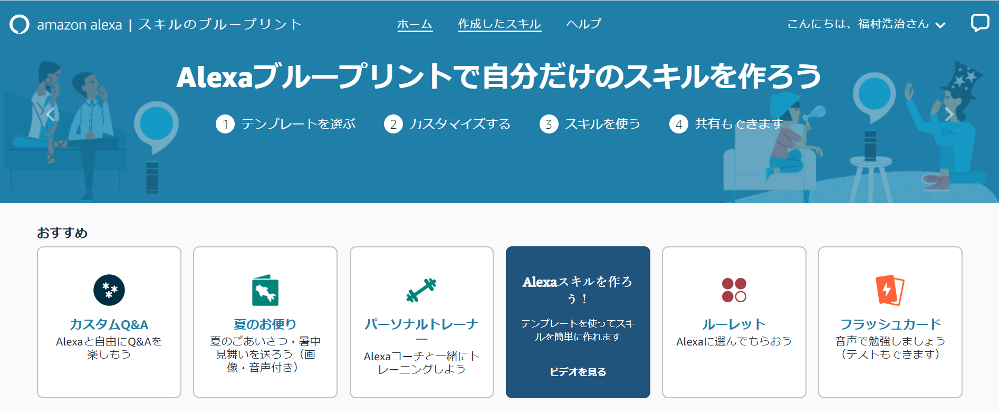
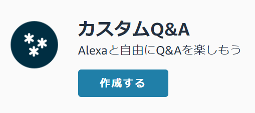
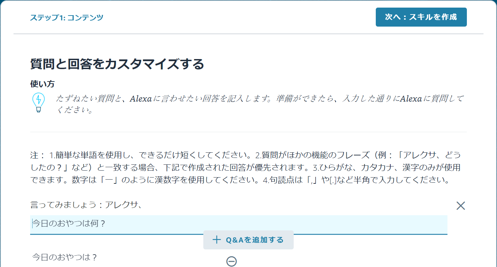
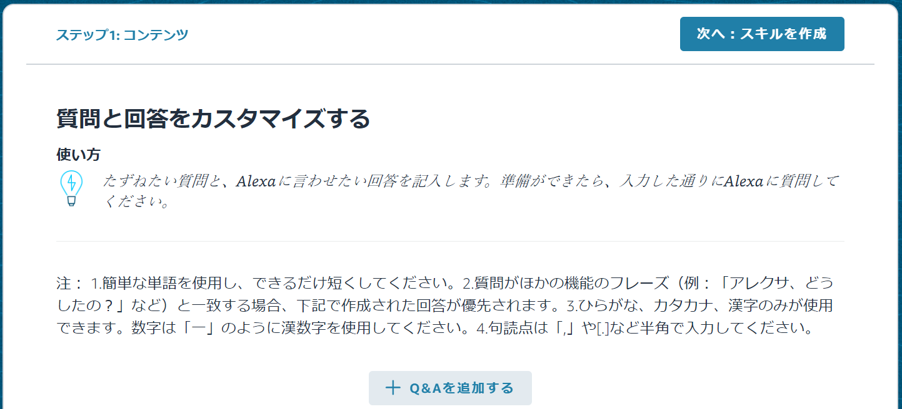
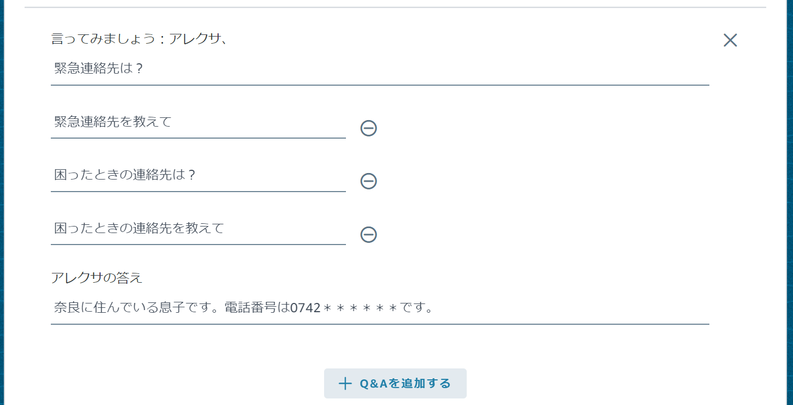
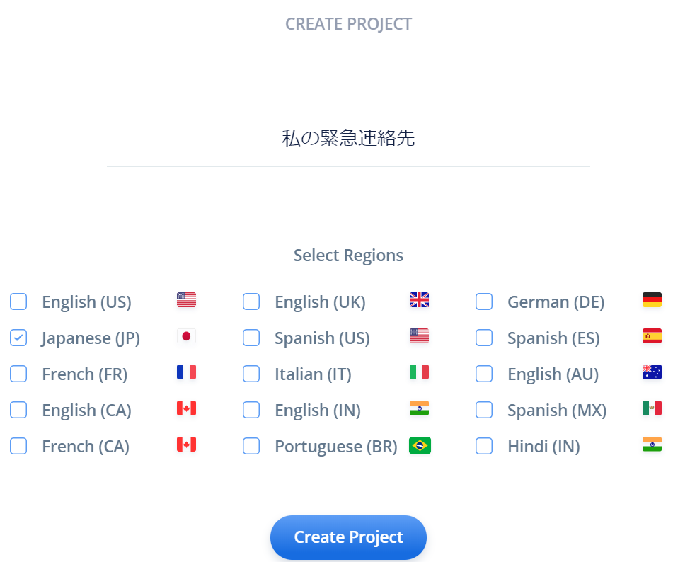
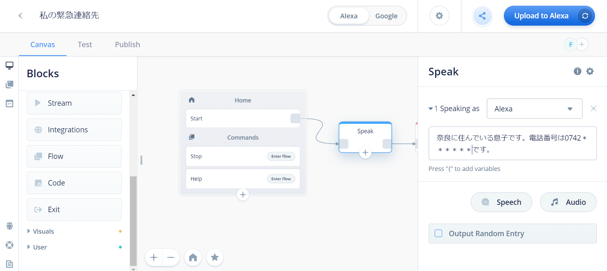
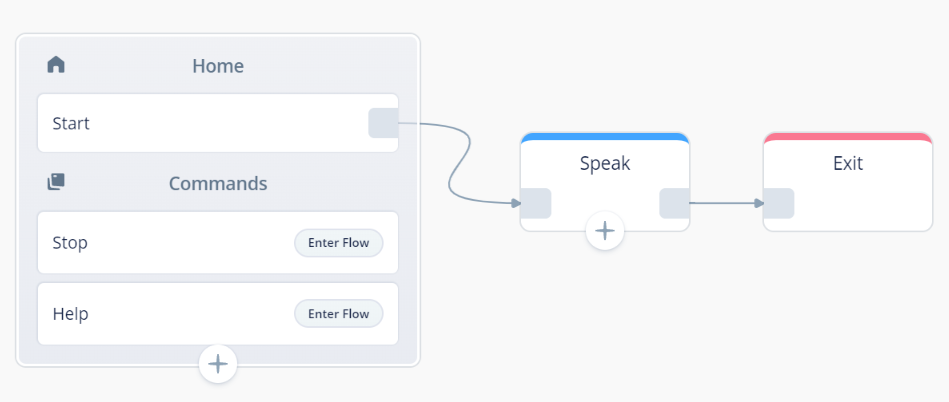

# オレトクなスキルを手軽に作るには
ノンコーディングで開発可能なVoiceflow、早速ご自分でAlexaスキルやGoogleアクション（以降「スキル」）を開発してみたくなったのではないでしょうか。

では、実際どんなスキルを開発すれば良いか、Voiceflowは、その特性上、非エンジニアの方がちょっとしたスキルを作るのにも向いているように思います。
スキルを開発して、みんなに作ってもらうのも良いけれど、自分の生活向上のために、自分だけのスキルを手軽に作る、こんなことも、ノンコーディングのVoiceflowだからこそのメリットではないでしょうか。

本章では、ご自分の生活に寄り添うスキルのユースケースを考え、是非、「オレトク」なスキル開発にチャレンジしてみましょう！

## 生活に寄り添うスキルのユースケース
さて、スキルに向いている内容とはなんでしょうか。当然ながらスキルはなんでもできるわけではなく、機能的には、通常みなさんがスマホで出来ること以上のことはできません。スキルの特定とは、音声でのやりとりができる、VUI(Voice User Interface)であることです。

スマホを操作するためには、指で操作するしかありません。しかしスキルであれば、音声で操作できるため、そのメリットを最大限生かせるユースケースを考えてみましょう。ポイントとなるのは、以下の３つではないでしょうか。

* ながら操作が可能
* 画面を見る必要がない
* （近くにスマートスピーカーがあれば）すぐに起動できる

### ながら操作が可能
両手がふさがっている状況、例えば料理中にレシピを聞きたい場合などに有効です。スキルと言えば、このメリットを生かそうというのが一般的で、よく聞くのが、朝の忙しい時間に、準備をしながら、ニュースを聞く、天気を聞くといった使い方です。スマートスピーカーを買ってみて、結局朝の天気を聞くのにしか使わなくなってしまったと言われることも多いですが、スマホを開いて、天気を検索して、内容を確認するという動作を、朝の準備をしながら出来るというのはメリットとして大きいのではないでしょうか。

### 画面を見る必要がない
最近は、Echo ShowやGoogle Nest Hub、Clova Deskなど、画面付きのスマートスピーカーも多いですが、画面はあくまで補足であり、音声でのやりとりで完結できるのがスキルの本質です。画面がないということは、視覚障害の方や老眼の方などにも有効になります。また、画面がないということは、どのボタンを押して、次にどれを選択してといった、複雑な操作を覚える必要がないということでもあります。操作のための学習コストを抑えられるというのは、スキルの大きなメリットではないでしょうか。

### （近くにスマートスピーカーがあれば）すぐに起動できる
スマホであれば、スリープを解除し、パスワードなり指紋認証を行い、それからブラウザなりアプリを起動させて、目的となる操作をするという動作となりますが、スキルの場合、スマートスピーカーは絶えず待機状態となっているので、すぐに目的となる操作をすることが可能です。手順が少ないということは、前述した操作のための学習コストの低減にもつながります。

近くにスマートスピーカーがあればという条件付きとなりますが、昨今はスマートスピーカー以外、車や電化製品にもVUIでの操作が可能となっていっています。特に
Alexaは、「Alexa Everywhere」構想を掲げており、どこでも音声によるユーザー体験を実現しようとしています。

これらのポイントを押さえ、ご自分の生活環境を鑑みて、有効なユースケースを考えてみましょう！

## VUIは高齢者向け？
私は普段、介護関係のエンジニアをしていますが、VUIは高齢者向けのインターフェースであると感じています。特に前述のポイントである「画面を見る必要がない」というのは、老眼でスマホを見れない、学習コストが低いというのは、それに合致しています。

あ

理由としては、以下の二点です。
* 慣れ親しんだ、「会話」で操作可能
* モニターを見る必要がないため、老眼でも大丈夫

Suica

VUIは生活に根差したもの
VUIは高齢者でも使いこなせる可能性が高い
VUIはITリテラシーの低い人でも
音声

スキル開発はエンジニアだけのものではありません。
開発

緊急連絡先を教えてもらう

## Blueprintsという選択肢も！
Voiceflowと同様にノンコーディングでAlexaスキルを作成する方法として、Blueprintsというものがあります。

[https://blueprints.amazon.co.jp/](https://blueprints.amazon.co.jp/)にアクセスしてください。

Blueprintsは、あらかじめひな形となるテンプレートがあり、それに対してカスタマイズするだけで、簡単にAlexaスキルを作成することが可能です。
2020年01月現在、テンプレートは以下のようなものがあります。

* グリーティング系（夏のお便り/お祝い/ありがとう/誕生日祝い）
* ランダムメッセージ系（お父さんありがとう/お母さんありがとう）
* フラッシュカード
* パーソナルトレーナー
* ルーレット
* カスタムQ&A
* トリビア

この中でも「カスタムQ&A」は特殊な特徴をもっています。
通常、スキルは「アレクサ、（スキル名）をひらいて」と発話することにより起動しますが、カスタムQ&Aはその必要がなく、「アレクサ、（質問内容）」と発話することで、アレクサは回答を返してくれます。

## BlueprintsとVoiceflowでスキルを作ってみる
では実際に、前述した「緊急連絡先を教えてもらう」を例として、BlueprintsとVoiceflowでスキルを作り比べてみましょう。

### Blueprints(カスタムQ&A)
Blueprintsホーム画面（[https://blueprints.amazon.co.jp/](https://blueprints.amazon.co.jp/)　で「カスタムQ&A」を選択し、「作成する」ボタンを押下します。

初期表示として、デフォルトの質問と内容が表示されます。

（デフォルトの質問は、おやつの内容やお父さんの好きな場所など、いかにも日常生活で使いそうな内容ですね！）

今回はデフォルトの内容は不要なので一旦削除します。

（削除しなくても問題ありません。）

ここから、「Q&Aを追加する」ボタンを押下して、緊急連絡先を教えてもらう際の、質問内容と回答を入力していきます。

「緊急連絡先は？」「困ったときの連絡先を教えて」など、想定できる質問内容をいくつか入力してみてください。必ずこのフレーズを言うというのであれば、ひとつでもかまいませんが、できるだけ柔軟にしたほうがストレスなく使えるようになります。

次に回答内容を入力してください。ここでは、緊急連絡先として、息子の電話番号を入力しました。

入力したら、「次へ　スキルを作成」ボタンを押下すれば、それで完了です。2，3分でスキルが完成します。

AlexaアプリかEchoデバイスで、「アレクサ、緊急連絡先は？」と聞いてみてください。回答を返してくれるはずです。

（BlueprintsはVoiceflowや通常のスキル開発などとは違って、テストのためのコンソール画面は存在しません。）

### Voiceflow
次に、同じ内容をVoiceflowでもつくってみましょう。

Voiceflowのホーム画面で「Create Project」を押下してください。

BlueprintsのカスタムQ&Aと違って、スキル名を入力する必要がありますので、ここでは「私の緊急連絡先」というスキル名にします。

複数の質問＆回答を行うスキルの作り方としては、以下が考えられますが、今回は緊急連絡先を知りたいという例ですので、すぐ回答してくれることを優先させるために、後者にしました。

* 複数の質問＆回答を行うスキルを作成し、スキル内で発話内容により分岐させる
* ひとつの質問＆回答を行うスキルを複数作成する

まず、Speakブロックを追加し、回答を入力します。

最後に、スキルを終了させるためのEXITブロックを追加して、これだけで完了です。

「Upload to Alexa」ボタンを押下して、スキルを完成させましょう。
テストコンソールや、Alexaアプリ、Echoデバイスで「アレクサ、私の緊急連絡先をひらいて」と言ってみてください。回答を返してくれるはずです。

## 非エンジニアでもスキルを作ろう！
このように、ノンコーディングでもスキルの作成は可能です。エンジニアだけでなく、非エンジニアの方こそ、よりユーザー目線で日常生活の困りごとを抱えてるのではないでしょうか。

Blueprintsはあらかじめ用意されたテンプレートに沿ったスキルしか作成できない代わりに、非常に簡単にスキルを作成できます。
それに比べて、VoiceflowはBlueprintsよりも、複雑になりますが、自由にスキルを作成できます。

どちらか一方ではなく、VoiceflowとBlueprintsを適材適所で使用して、是非、スキル作成にチャレンジしてください！
