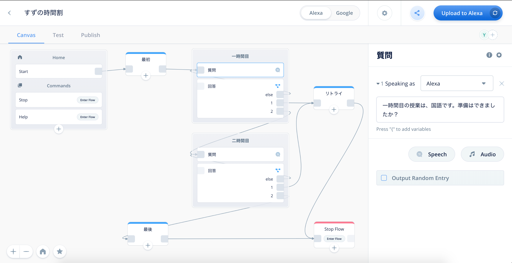
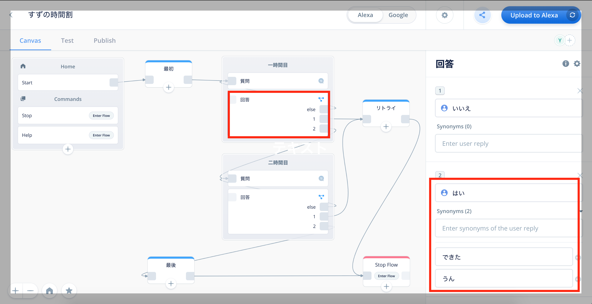
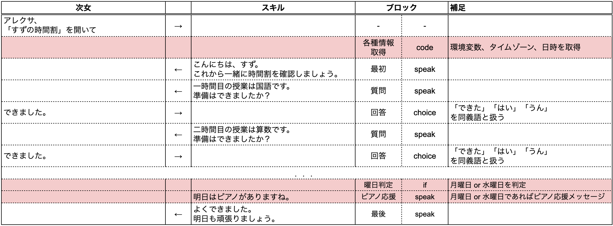
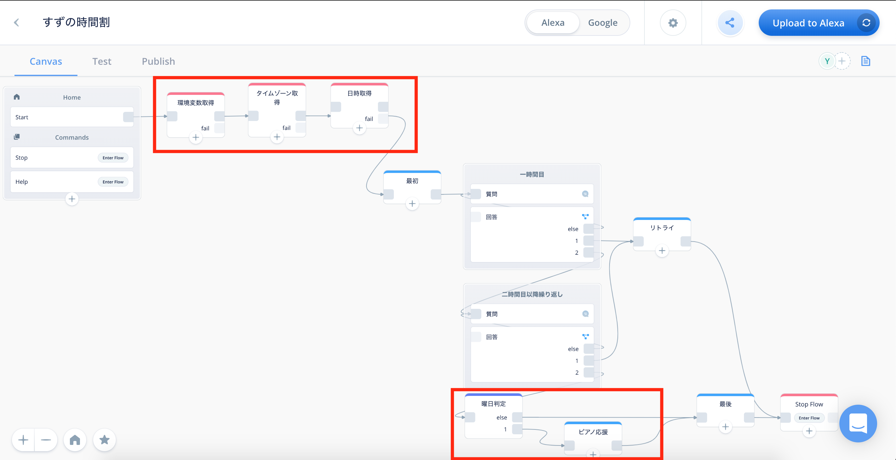
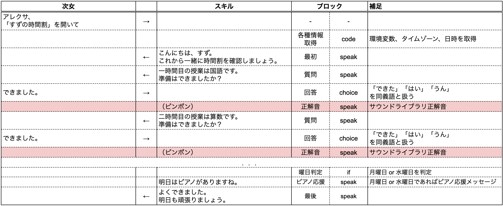
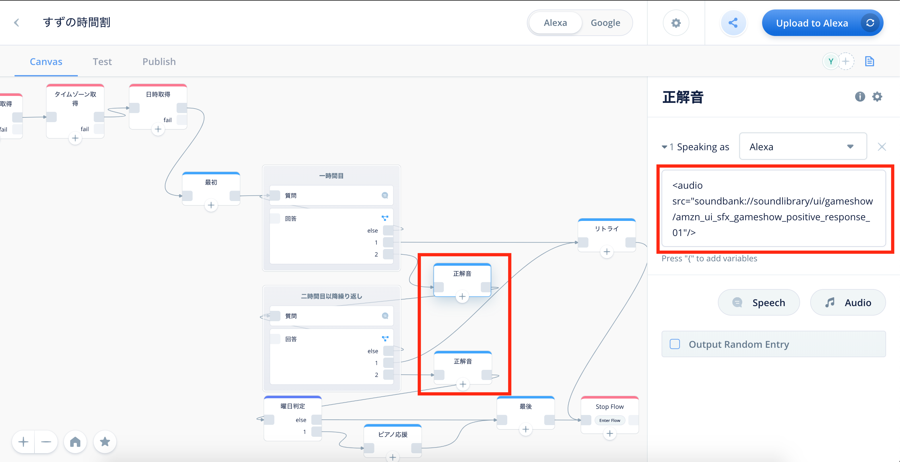
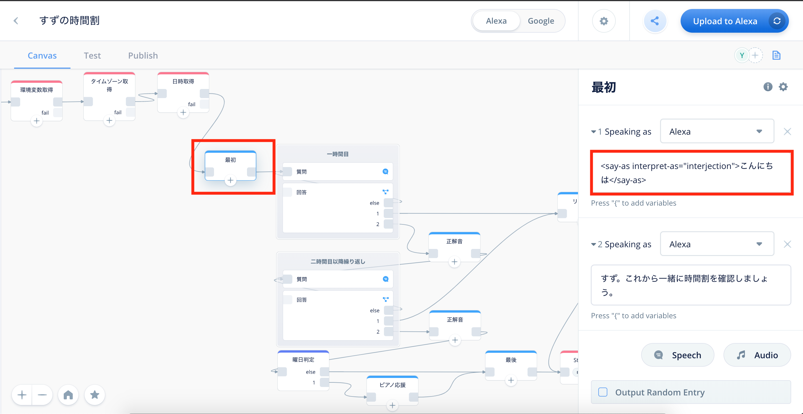

# エンゲージメントを考えてみよう
## はじめに
”あんなスキルがあったらうれしい”、”こんなスキルが作れたら楽しそう” Voiceflowでは、思いついたらすぐにスキル開発を始めることができます。  
せっかく作るのであれば、使う人が喜んでくれたり使いやすいスキルを作りたいですよね。

本章では、はやる気持ちを少し抑えて、愛着を持ってもらえるスキルを作るにはどうしたらよいか？を考えてみたいと思います。

### 対象読者
本章が対象とするのは下記の方です。

- ちょっとだけVoiceflowをさわったことがある方
- VUIアシスタントとの会話が素っ気なく感じる方

## 意識しよう
### エンゲージメントとは
エンゲージメントとは、ざっくり言うと親近感・愛着・思い入れといった「繋がり」のことです。

エンゲージメントを高めるには、”スキルを使う人はどんな人か”、”スキルを使ったら何が嬉しいのか”を考えてたうえでスキルを作る必要があります。
ユーザーを深く知る（具体的に定義する）ために、「ペルソナ」というツールを使います。

### ペルソナとは
ペルソナとは、サービスにとって最も典型的なユーザー像のことです。  
ユーザー像を具体的にして、ユーザーにフィットさせることで、より満足度の高いサービスを提供できるようになります。  

//embed[latex]{
\clearpage
//}

あまり深く考える必要はありません。  
専門的なことを知らずにスキル開発できるのがVoiceflowの強みですので、「ある人専用のスキルを作るために、ある人がどんな人かイメージを固める」という捉え方で良いです。

ペルソナを設定しておくメリットとして、次の３つがあります。
> - 担当者間で、共通した人物像を形成できる
> - ユーザー視点の精度を高めることができる
> - 時間、コストの削減ができる

ferretより。URL: https://ferret-plus.com/8116

## サンプルスキルの開発
それでは、エンゲージメントを考えながらスキル開発をしていきましょう。  

例えば「小学校の子どもが時間割を確認するスキル」を思いついたとします。  
”小学生”では抽象的なので、もっとユーザーに寄せていきます。

### ペルソナの設定
ペルソナの設定をしてみましょう。  
具体的なユーザーが決まっていれば、そのユーザーをイメージして整理をします。  
整理する内容については様々な考え方がありますが、最初は分かっていることを並べるだけでもよいと思います。  
大事なのは、この時点で「情報の取捨選択をしない」ことです。どこでどう役立つか分かりませんので、選択肢は残しておきましょう。

ここでは、同じテーマであっても求められるものに違いが出ることが分かるように、二人の小学生のペルソナを書いてみます。


//embed[latex]{
\clearpage
//}

あっさりめですが、それぞれのペルソナに沿った時間割のスキルを考えていくと

- 長女は、もうすぐ小学四年生であることから、自分で翌日の準備ができることが想像できるので「準備ができた後に、確認をしてあげるスキル」
- 次女は、まだ入学前であることから、一人で翌日の準備をすることに不慣れなので「一緒に準備を進めてあげるスキル」

が喜ばれそうです。

このように、ユーザーについて整理をすると、同じテーマのスキルであっても求められるものに違い出ることがわかります。

### UIの検討
次にそのスキルのUIについて検討をします。  
VoiceUIありきで考え始めましたが、このタイミングで本当にその必要があるかを考えて下さい。  
その際に入力も出力も音声で検討する必要はありません。既存のUIと組み合わせることも可能なので、ユーザーの体験向上に一番効果の高いものを選択しましょう。  
ユーザーの利用シーンをイメージして下さい。スキルがどのタイプなのか考えみましょう。


例題では、スキルを使う子供たちの利用シーンを下記とイメージしました。

- 学校から配布された時間割を見ているため視線が奪われている
- ランドセルの中の教科書を出し入れするため両手が使えない

したがって、入出力ともに音声のタイプAが適していると考えました。

//embed[latex]{
\clearpage
//}

### 会話フローと内容
ペルソナを設定したことで、それぞれの状況や課題が明確になり、長女と次女で会話や内容を変える必要があることが分かりました。  
それぞれのペルソナに沿って、会話フローと内容を考えます。

#### 長女の場合
自分で翌日の準備ができるので、準備したものを長女に発話させ、アシスタントがOK/NGを判定するようにしました。  
アシスタントとクイズ形式で会話し、正解をすることが楽しくなることを狙います。


#### 次女の場合
自分で準備ができるようになってほしいので、アシスタントが準備する物を発話し、できた/できないを答えさせるようにしました。  
こちらも、自分で準備することが楽しくなっていくことを狙います。


//embed[latex]{
\clearpage
//}

### Voiceflowでスキル作成
テーマも会話フローも同じですが、会話内容はそれぞれに特化した内容になっており、エンゲージメントが高くなっていると言えます。  
この設計書に沿ってVoiceflowでスキルを作ってみましょう。

例題では、次女の会話フローからスキルを作ります。




これで次女専用のスキルが出来上がりました。

//embed[latex]{
\clearpage
//}

## エンゲージメントを高めるために
エンゲージメントを高めるためにスキルに味付けをします。  

### シノニム
人間同士の会話では、無意識に「はい」と「YES」を同義語として認識しますが、アシスタントは、同義語かどうかを判別してくれません。
そこで、ユーザーが言いそうな同義語（言い間違えも含めて）を登録し、スムーズな会話となるようにします。

例題では、「できました」に同義語を登録していきます。




これで「準備はできましたか？」の問いに対して、「できました」「できた」「はい」「うん」と答えることができるようになりました。

//embed[latex]{
\clearpage
//}

### 日時の情報
スキルが使われた日付情報を使うことができ、曜日や時間帯に合わせてメッセージを変えたり、ユーザーのカレンダー等に合わせた会話が可能になります。

例題では、習いごとの前日は、ピアノを応援するメッセージを追加で言うようにします。  

「code」ブロックの使い方は、Voiceflow公式のフォーラムに丁寧に乗っていますので参考にしてください。  
https://forum.voiceflow.com/t/getting-the-users-time-zone-in-your-skill/314





これで、ピアノの前日に「明日はピアノですね」と伝えることができるようになりました。

//embed[latex]{
\clearpage
//}

### SSML
ベンダー毎にサポートされているタグが異なったり、独自のタグがある

- alexa
  - https://developer.amazon.com/ja-JP/docs/alexa/custom-skills/speech-synthesis-markup-language-ssml-reference.html
- google
  - https://cloud.google.com/text-to-speech/docs/ssml?hl=ja

//embed[latex]{
\clearpage
//}

#### サウンドライブラリ
効果音を鳴らすことができます。
クイズ番組の”正解／不正解の音”のように、効果的に音を鳴らすことでユーザーの体験を向上させることができます。  
Voiceflowでは、2つの方法で効果音を鳴らすことができます。  
ひとつは、自身で音声ファイルをアップロードし鳴らす方法、もうひとつは、ベンダーが用意している音声ファイルを鳴らす方法です。  
ベンダーが用意している音声ファイルとは、それぞれのベンダーがサウンドライブラリとしてスキル用に公開しているもので自由に使うことができます。

- Alexa Skills Kitサウンドライブラリ
  - https://developer.amazon.com/ja-JP/docs/alexa/custom-skills/ask-soundlibrary.html
- Google Assistant Sound Library
  - https://developers.google.com/assistant/tools/sound-library

例題では、「準備はできましたか？」の問いに対して「できました」と回答した場合、ベンダーが用意している音声ファイルを使って効果音を鳴らします。  
「speak」ブロックに`audio`タグを入力します。Alexaスキルの場合、サウンドライブラリでタグのコピーが可能ですので、コピペします。

```
<audio src="soundbank://soundlibrary/ui/gameshow/amzn_ui_sfx_gameshow_positive_response_01"/>
```





これで、正解をサウンドで伝えることができるようになりました。

//embed[latex]{
\clearpage
//}

#### Speechcons

- Alexa
  - https://developer.amazon.com/ja-JP/docs/alexa/custom-skills/speechcon-reference-interjections-japanese.html


例題では、最初のあいさつ「こんにちは」をSpeechconを使って発話させます。  
「speak」ブロックに`say-as`タグ、属性`interpret-as="interjection"`を入力します。

```
<say-as interpret-as="interjection">こんにちは</say-as>
```




これで、「こんにちは」が表情豊かになりました。

//embed[latex]{
\clearpage
//}

## おわりに
他にもVoiceflowの機能を使うことで更にエンゲージメントを進めることが可能です。

- 会話フローにさらに分岐を追加する
- BlocksメニューのUserカテゴリ「user info」にてユーザー固有の情報を使う
- BlocksメニューのAdvancedカテゴリ「Integrations」にて外部と連携する
- 時間割が完了したら親にメールやSMS等で通知する

本格的にパーソナライズする場合、もっと様々なことを考える必要があります。
