# スマートリモコンをM5StickCで自作し、Google Homeから家電を操作

## 概要

電子工作クラスタの人に「簡単に音声操作インタフェースをつける方法」を知っていただきたく、この賞を書きました。
あるいはVUIクラスタの人も、もしまだでしたら```ぜひ軽率に電子工作へとハマりましょう。```


今回は、人気の格安小型マイコン「M5StickC」を使います。スイッチサイエンスの通販サイトや、秋葉原の千石電商で売っています。
ちゃんとケースに入っていますので、感電の心配もありません。


そのほかに、MQTTやIFTTTなどIoTのプロトタイピングに使えるテクを寄せ集めていますので、何かのヒントになりますと幸いです。


#### やること

* M5StickCで赤外線リモコン作成 
* AdafruitのMQTTブローカの設定 
* IFTTTでMQTTの簡易パブリッシャーを作る 
* VoiceflowでActions On Googleを作成 
* M5StickCリモコンをMQTT対応にする
* 全部をつなげて動作確認

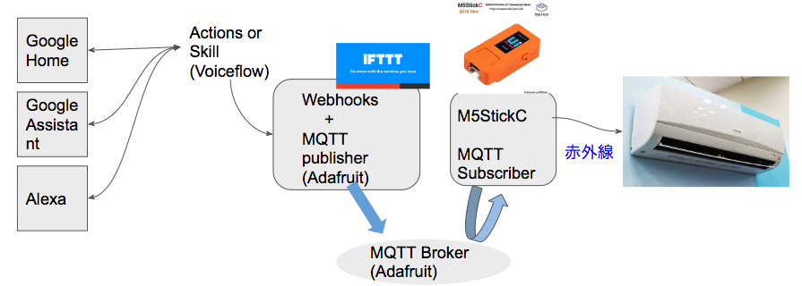

#### 開発環境

* MacBook Air（macOS Mojave）
* Arduino IDE 1.8.9
* Chrome 最新版
* メモ帳（お好みのエディタ、なんでも。自分はいつものVSCodeを使いました。）

自分はMacを使いましたが、Windowsにも共通のツールがあります。適宜読み替えて進めてください。

#### 使用した部品、スマートスピーカー

* M5StickC ¥1,980　
* M5用、赤外線送受信ユニット ¥308
* Google Home mini ¥3000
* * 現在はGoogle Nest Miniと改名
* * Google HomeやNestシリーズならなんでもOK。
* * iPhoneやAndroidのGoogle Assistant appでもOK。

M5StickCと赤外線送受信ユニットの値段は、スイッチサイエンス通販サイトにおける2020年1月12日時点の税込価格です。

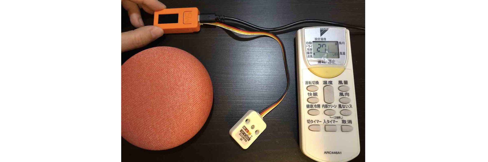

//embed[latex]{
\clearpage
//}


## M5StickCで赤外線リモコン作成

### Arduino IDEのインストール

Arduino IDEをインストールします。すでに使っている人はスキップしてください。

* chromeでArduinoのWebページ (https://www.arduino.cc/)を開く。
* 「SOFTWARE」→「DOWNLOAD」をクリック。
* 「Download the Arduino IDE」の段落にある「```Mac OS X 10.8 Mountain Lion or newer```」をクリック。
* 「Contribute to the Arduino Software」というページが開いたら「JUST DOWNLOAD」をクリック@<fn>{sitopp_donate}。
* 約200MBあるファイルのダウンロードが終わるのを待つ。
* ダウンロードしたzipファイルを展開するとアプリケーション「Arduino.app」が現れるので、アプリケーションフォルダに移動。


//footnote[sitopp_donate][彼らの活動を支援したい方は是非寄付を（＾o＾）]


### Arduino IDEにM5StickCのxxxを取り込む

* Arduino IDEを起動します。
* 「sketch_〜」というエディタが開きますが、今は使いません。
* 「Arduino」＞「Preferences..」をクリックすると「環境設定」画面の「ネットワーク」が開きます。
* 「```追加のボードマネージャのURL```」入力欄の右にある窓のアイコンをクリックします。
* 以下のように2行入力してOKをクリックします。

```
https://dl.espressif.com/dl/package_esp32_index.json
http://arduino.esp8266.com/stable/package_esp8266com_index.json
```
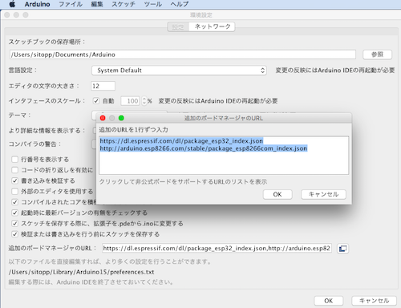

* 「環境設定」画面の右下にある「OK」をクリックして閉じます。


* 次に「ツール」→「ボード：〜」→「```ボードマネージャ...```」を開きます。
* 「```タイプ　全て```」の右の入力欄に、「```esp32```」と入力します。
* 「esp32 by Espressif Sysrems」がヒットしたら「インストール」をクリックします。
* インストールが終了したら「閉じる」をクリックして```ボードマネージャ```を閉じます。


* 次に「スケッチ」→「ライブラリをインクルード」→「ライブラリを管理」をクリックします。
* 「```ライブラリマネージャ```」が開いたら「```タイプ　全て```」の右の入力欄に「```M5StickC```」と入力します。
* 「M5StickC by M5StickC バージョン〜」がヒットしたら「インストール」をクリックします。
* インストールが終了したら「閉じる」をクリックして```ライブラリマネージャ```を閉じます。
* 「Arduino」→「Quit Arduino」でIDEを終了してから、再起動します。


これでArduino IDEの初期設定、M5StickCと赤外線送受信ユニットを使う準備ができました。


### M5StickCで、赤外線リモコンの命令パターンをキャプチャする

ここから先は、使いたい家電の赤外線リモコンと、M5StickCを使います。

* M5StickCに```赤外線送受信ユニット```をしっかりさします。
* M5StickCをUSB Type-CケーブルでMacに接続します。
* 「ツール」→「ボード」→「M5StickC」を選択します。
* 「ツール」→「シリアルポート」→表示された複数の選択肢の中から、「/dev/cu.usbserial-」の文字が入っているものを選択します。

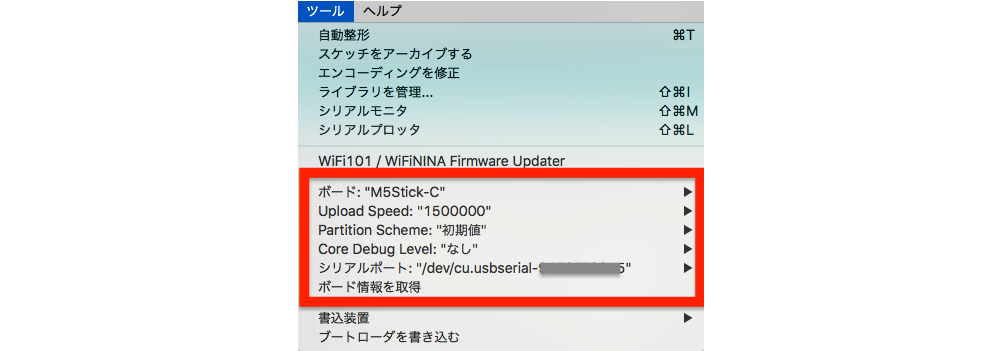


* Arduino IDEの「ツール」→「ライブラリを管理」→「IRremoteESP8266」と入力し、表示されたライブラリをインストールします。
* 「ファイル」→「スケッチ例」→「IRremoteESP8266」→「IRrecvDumpV2」を開きます。
* 「ファイル」→「新規ファイル」でスケッチエディタを開きます。自動的に「sketch_日付」という名前が生成されます。
* 「sketch_日付」スケッチエディタに下敷き表示されたコードを全文削除してください。
* 「IRrecvDumpV2」のコードを全文コピーして「sketch_日付」に貼り付け、以下の一行だけ書き換えます。

```
const uint16_t kRecvPin = 14;
↓
const uint16_t kRecvPin = 33;
```

* スケッチエディタの左上にある「✔︎」の右隣の「→」アイコンをクリックして、M5StickCに書き込みします。
* 保存場所を聞かれるので、指定されたArduinoフォルダ以下のまま保存します。
* スケッチのコンパイル、および、書き込みに数十秒〜数分かかるので気長に待ちます。
* 「IRrecvDumpV2」のスケッチはもう使わないので、左上のxをクリックして閉じます。
* 「sketch_日付」スケッチエディタの下に表示されている黒背景部分に、オレンジの文字でインストールログがどどっと出力されます。以下のようなメッセージが出たらインストール完了です。

```
Writing at 0x00008000... (100 %)
Wrote 3072 bytes (128 compressed) at 0x00008000 in 0.0 seconds 
Hash of data verified.

Leaving...
Hard resetting via RTS pin...
```

* 「ツール」→「シリアルモニタ」をクリックして、窓を開きます。
* 「自動スクロール」にチェックが入っていることを確認しましょう。
* 対象となる家電のリモコンを持ってきてください。
* 赤外線ユニットの20〜30センチ以内でリモコンを操作してください。（下図参照）
* シリアルモニタにコードが出力されます。
* このログを全文コピーして、メモ帳などに保存しておきます。

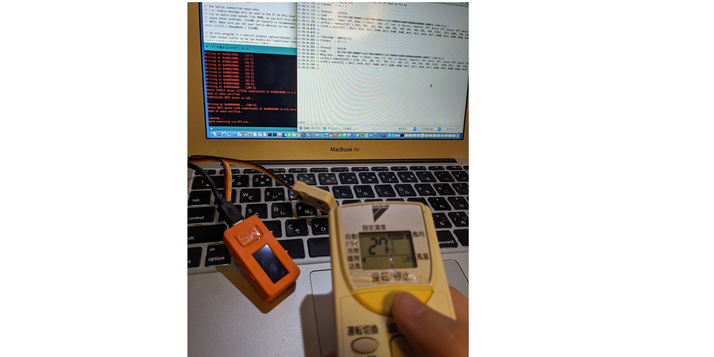

例）うちのDaikinのエアコンのリモコンで、オフとオンを1回ずつ押した時の赤外線の命令パターンは以下のようになりました。

```
21:39:17.721 -> Timestamp : 000130.976
21:39:17.721 -> Library   : v2.7.1
21:39:17.721 -> 
21:39:17.721 -> Protocol  : DAIKIN
21:39:17.721 -> Code      : 0x11DA2700C50000D711DA270042000054（以下略）
21:39:17.721 -> Mesg Desc.: Power: Off, Mode: 4 (Heat), Temp: （以下略）
21:39:17.792 -> uint16_t rawData[583] = {492, 396, （略）466};  // DAIKIN
21:39:18.076 -> uint8_t state[35] = {0x11, 0xDA, 0x27, 0x00,（略）0x76};
21:39:18.076 -> 
21:39:18.076 -> 
21:39:34.883 -> Timestamp : 000148.122
21:39:34.883 -> Library   : v2.7.1
21:39:34.883 -> 
21:39:34.883 -> Protocol  : DAIKIN
21:39:34.883 -> Code      : 0x11DA2700C50000D711DA270042000054（以下略）
21:39:34.883 -> Mesg Desc.: Power: On, Mode: 4 (Heat), Temp:  （以下略）
21:39:34.945 -> uint16_t rawData[583] = {510, 374,（略）494};  // DAIKIN
21:39:35.211 -> uint8_t state[35] = {0x11, 0xDA, 0x27, 0x00,（略）0x77};
21:39:35.248 -> 
```


### 赤外線リモコンの命令パターンの抽出と、C++コードへの反映

赤外線リモコンの命令パターンはメーカー間で統一されておらず、フォーマットが違います。
この本ではDaikinのエアコンのやり方について説明します。@<fn>{sitopp_maker}

//footnote[sitopp_maker][Daikin以外のメーカーについては、ググるといろいろ親切に解説してくださっているページがありますので、「Daikin以外のメーカーの場合」の項目を参照ください。]


* Arduino IDEの「ツール」→「ライブラリをインクルード」→「ライブラリを管理」→「IRsend」と入力し、表示されたライブラリをインストールします。
* 以下のURLに、私が書いたDaikinの赤外線リモコンを送信するコードが置いてありますので、アクセスしてください。

```
URL：https://GitHub.com/sitopp/vf_techbookfest8_sampleCode
ファイルパス：M5StickC/IRsendDemo_DAIKIN.ino
※ 404エラーが出た場合は、GitHubにログインしてからもう一度開いてください。
※ アカウントがない場合は、先に作ってからログインしてください。
```

```
コードの抜粋：

#include <M5StickC.h>
#include <IRremoteESP8266.h>
#include <IRsend.h>

const uint16_t kIrLed = 32;  
IRsend irsend(kIrLed);  

void setup() {
    irsend.begin();
}
（以下略）
``` 


* Arduino IDEの「ファイル」→「新規ファイル」でスケッチエディタを開きます。下敷き表示されたコードは削除してください。
* IRsendDemo_DAIKIN.inoの全文をスケッチエディタに貼り付けてください。
* スケッチエディタ上で、赤外線のパターンを書き換えます。

例）
Daikinの場合、「uint8_t daikin_code[35]={}」の中身を、先ほど採取した赤外線のパターンの「uint8_t state[35] ={}」の中身で上書きをします。35は配列の要素数ですので、数が違う場合は合わせて変更してください。


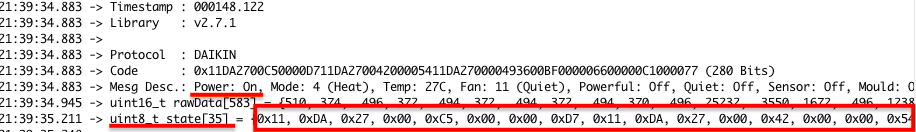

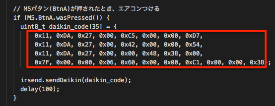
このサンプルコードでは、見やすいよう改行を入れています。

例）Daikin以外のメーカーの場合、「uint8_t daikin_code[35]={}」は使わず、「irsend.sendDaikin（daikin_code）;」でも送信できません。「Daikin以外のメーカーの場合」を参照ください。


* スケッチエディタの左上にある「→」アイコンをクリックして、M5StickCに書き込みします。
* ファイルの保存場所を聞かれるので、適当に指定します。
* 書き込みにかかる時間、数十秒を待ちます。
* スケッチエディタの下半分にインストールログがどどっと出力され、「Hard resetting via RTS pin...」メッセージが出たらインストール完了です。
* USBケーブルを抜いて、M5StickCをエアコンの50cn以内に持っていきます。赤外線送受信ユニットは抜かずにさしたままです。M5ボタンを押すと、エアコンがつきました。

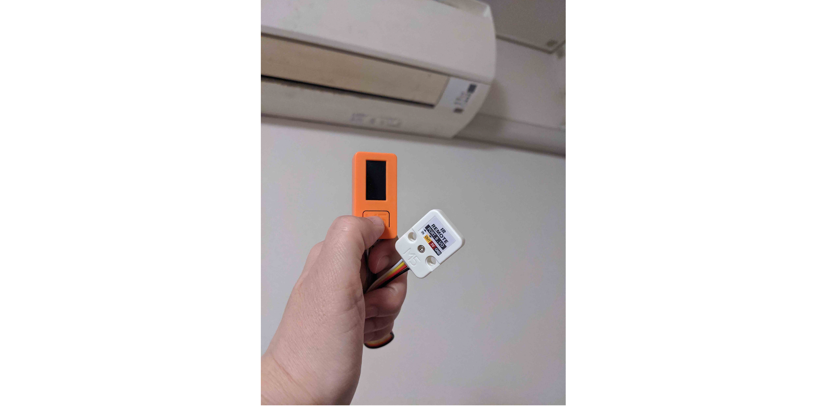

### トラブルシュート

赤外線は目では見えません。スマートフォンのフロントカメラで赤外線送受信ユニットの出力部分を写すとわかります。以下はiPhone Xで撮ったの写真です。このように写真は撮影しなくても、カメラに写すだけで、弱く紫っぽい色がかすかに光る様子が見えます。

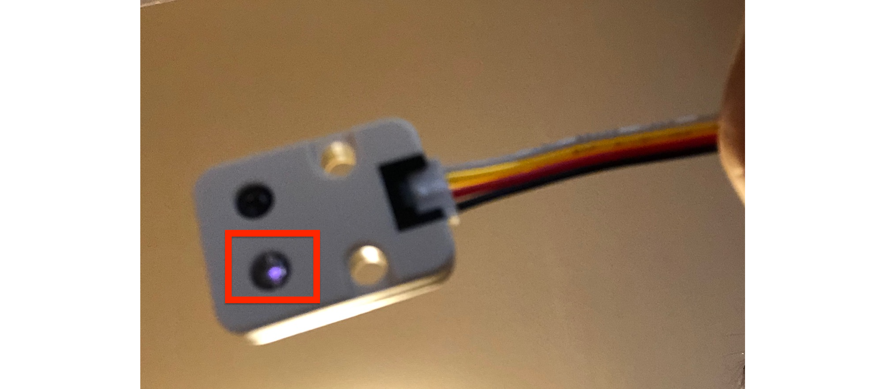

### Daikin以外のメーカーの場合

ありがたいことに、IRremoteESP8266ライブラリの作者のGitHubにサンプルコードがあります。

https://GitHub.com/crankyoldgit/IRremoteESP8266

しかし、これだけでは良くわからないので、
とても参考になる有益な**神ブログ**をいくつか紹介します。

* M5StickCでスマートフォンから操作できる家電リモコンを作る（NECの例）

https://elchika.com/article/218f5072-28a6-461c-a801-43390305f4cc/

* M5StickC を赤外線リモコンにする（各種テレビメーカーの例）

https://kuratsuki.net/2019/07/


## AdafruitのMQTTブローカの設定

* Adafruit（エイダフルート）https://io.adafruit.com/ にアクセスし、アカウントを作成します。
* 「Actions」 → 「Create a New Dashboard」で、ダッシュボードを作成します。
* * Name：voiceflowIRDev
* * Description：開発用

* 「Feeds」 → 「View All」 → 「Actions」 → 「Create a new feed」でFeedsを作成します。
* * Name：daikin_onoff
* * Description: Daikin 赤外線リモコン なりすまし用

* 「Feeds」 → 「View All」→ 「daikin_onoff」 → 「Feed Info」
* * 「MQTT by Key」のところにMQTTのTopicが自動生成されていますので、メモ帳にコピーしておきます。

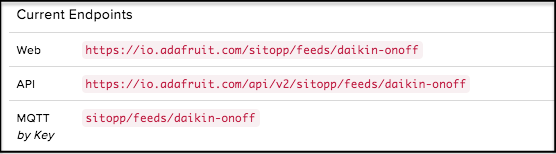


* MQTTブローカのサーバ情報を調べておきます。

https://io.adafruit.com/api/docs/mqtt.html#mqtt-connection-details

```
Host	io.adafruit.com
Secure (SSL) Port	8883
Insecure Port	1883
**MQTT over Websocket	443
Username	Your Adafruit IO Username
Password	Your Adafruit IO Key
```

なおUsername/passwordは、```https://io.adafruit.com/```のユーザーアカウントではありません。
ダッシュボードの右肩にある```AIO Key```をクリックすると閲覧できます。

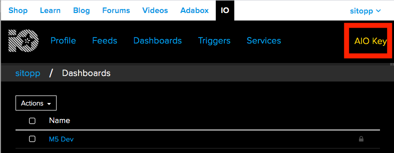


## IFTTTでMQTTの簡易パブリッシャーを作る

Webhooksで発行されたURLにアクセスすると、AdafruitのMQTTブローカにTopicをパブリッシュするというしくみを作ります。

* IFTTT（イフト）にログインします。 ```https://ifttt.com/```
* 右上の人型アイコンをクリック → プルダウンメニューが表示されたら、「Create」 をクリック。
* 「Create your own」画面で「This」をクリック。
* 「Search services」という入力欄に「Webhooks」と入力 → 表示された「Webhooks」のパネルをクリック。
* 初回利用の人は、「Connect Webhooks」という画面が表示されるので、Connectをクリック。
* 「Receive a Web request」のパネルをクリック→ Event Name:「```M5StickCIRRemoCon```」と入力。
* 「Create trigger」→ 「That」をクリック →「Search services」という入力欄に「Adafruit」と入力。
* 表示された「Adafruit」のパネルをクリック。
* （初回利用の場合）「Connect Adafruit」という画面が表示されるので、Connectをクリック。ポップアップ画面で下にスクロールし、「Authorize IFTTT」の下にある「AUTHORIZE」をクリック。
* ```Send data to Adafruit IO```のパネルをクリック。
* 「Feed name」の選択肢で、先ほどAdafruitで登録したFeed「daikin_onoff」を選ぶ。
* 「Data to save」の右下にある「Add ingredient」をクリックし、EventNameをクリックする。
*  再度「Add ingredient」をクリックし、Value1、Value2、Value3もクリックする。「Data to save」は「{{EventName}} {{Value1}} {{Value2}} {{Value3}}」となる。
* 「Create action」→「Finish」

完成後、右上の「settings」をクリックするとIFTTTレシピの詳細が見れます。

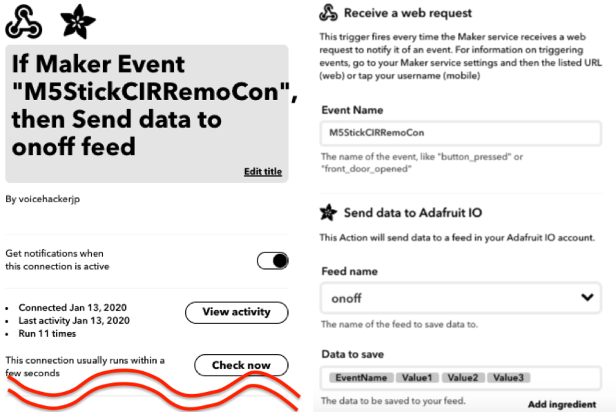

#### WebhooksのURLを調べる

* ChromeでIFTTTの「My Services」にアクセス https://ifttt.com/my_services 
* 「Webhooks」 → 「Documentation」
* 「Make a POST or GET Web request to」の下にあるURLの{event}の所に「M5StickCIRRemoCon」と入力する。```https://```から始まるURLをコピーしてメモ帳などに控えておく。
* 「With an optional JSON body of:」の下にあるJsonをコピーして、メモ帳などに控えておく。

```
URL：https://maker.ifttt.com/trigger/M5StickCIRRemoCon/with/key/(略)
JSON：{ "value1" : "", "value2" : "", "value3" : "" }
```

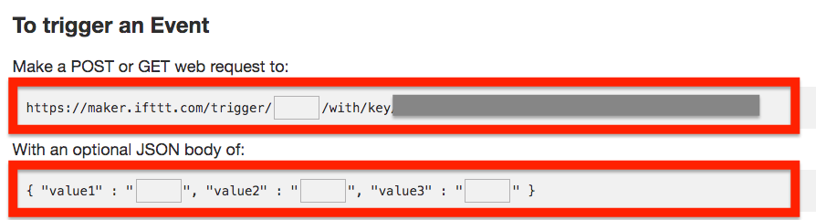


## VoiceflowでActions On Googleを作成

### 暖房をつけるフローの作成

* Chromeでvoiceflowにアクセスし、ログインします。https://www.voiceflow.com/
* create Project」クリック → 「Enter your Project name」に、Actions名を入力する。

例）Actions名を「しょういんじ」にした場合、Google Homeに「OK Google しょういんじを呼んで」と話しかければ起動できます。

* Select Regions画面で「Japanese」にチェックを入れ、「English（US）」のチェックを外す→「create Project」をクリック

canvasが開いたら、淡々と作っていきます。

* ヘッダ部分の「Alexa Google」の切り替えスイッチを、Googleの方にする。すると「Upload to Alexa」のボタンが「Upload to Google」に変化する。


* Blocksメニューの「▶︎Advanced」をクリックして開き、「Interaction」ブロックをcanvasにドラッグ。
* Homeブロックの「Start」の右端から線を出して接続する。
* クリックして設定画面を開き「```Intents```」→「```+Add Intent```」をクリック
* 「Intent_one」の字の上をクリックして編集できる状態にし、「aircon_on」と上書き入力
* 「Enter user reply」入力欄に「暖房つけて」と入力してエンター
* 「Enter user reply」入力欄に「エアコンつけて」と入力してエンター
* 「Enter user reply」入力欄に「暖房をつけて」と入力してエンター
* この要領で```「aircon_off」Intent```も作成

```
Intent名 ： aircon_on
user reply : 暖房つけて、エアコンつけて、暖房をつけて

Intent名 ： aircon_off
user reply : 暖房けして、暖房を消して、エアコン消して
```
* 同じInteractionブロックをクリックして設定画面を開き、「Choices」をクリック 
* 「+Add Choice」→「1」の選択肢に「aircon_on」を指定
* 「+Add Choice」→「2」の選択肢に「aircon_off」を指定

脚注：ChoicesはAlexaとGoogleで異なるため、アップロード先をAlexaにする場合はそれ用に追加して作る必要があります。お忘れなきよう。

* 一番左の細いペインの上から3番目のアイコン「Variables」をクリック
* Create Variable（Project）の入力欄に「device」と入力してエンター
* するとそのすぐ下のVariablesのリストの末尾に「{device}」が追加される
* 同様に{onoff}も追加

```
Variablesに追加するパラメタ：
{device}
{onoff}
```

* 一番左の細いペインの一番上のアイコン「Blocks」をクリック。
* 「▶︎Logic」→「Set」ブロックをCanvasにドラッグ、Interactionの右側「１」から線を出して接続する。
* setブロックをクリックし、設定画面を開いたら、以下のように指定。2個目を追加するときには「Add Variable Set」をクリックすると入力欄が追加される。

```
set {device} to: 「aircon」
set {onoff} to: 「on」
```

* 「▶︎Basic」→「Speak」ブロックをCanvasにドラッグ、Setの右側から線を出して接続する
* Speakブロックをクリックし、設定画面を開いたら、以下のように指定。

```
Speaking as Alexa
暖房をつけます
```
* 「▶︎Advanced」→「Integrations」ブロックをCanvasにドラッグ、Speakの右側から線を出して接続する。
* Integrationsブロックをクリックし、設定画面を開く。
* 「Chose an Integration」では「Custom API」をクリックし、以下のように指定。


```
Request URL
POST▼　https://maker.ifttt.com/trigger/M5StickCIRRemoCon/with/key/(略)

※先ほどIFTTTのWebhooksで発行されたURLを使います。(略)の所はユーザーごとに異なるkeyが入っているためセキュリティ上省略してますが、記入するときは省略せずに入れてください。
```

* その下にある、「Headers Body Params」のうち、「Headers」をクリックして以下のように設定。

```
Enter HTTP Header：Content-Type
VALUE application/json
```

* その下にある「Headers Body Params」の「body」→「Form Data」をクリックして以下のように入力

```
value1
VALUE {device}

value2
VALUE {onoff}

value3
VALUE t7d=ClVt （任意の文字列を入力してください。）
```
注：「t7d=ClVt」の部分の8文字は、他人に知られていない文字列を考えて代入してください。
目をつぶってキーボードをめった打ちにするか、パスワード自動生成サイトなどを使うと良いです（^o^）

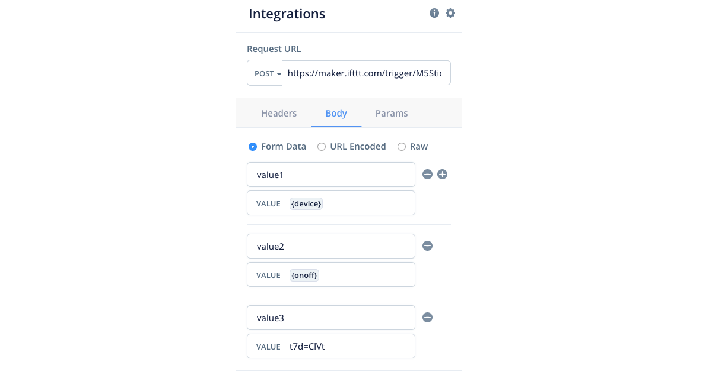

### Voiceflow内でブロックのユニットテスト

* 入力欄の右の下の方にある「Test Request」をクリック。
* ポップアップが開いたら「Raw」タブを開く。
* ```「Congratulations! You're fired the M5StickCIRRemoCon event"」```と表示されればOK。もしエラーなら、POSTのURLが間違っているので見直す。

* IFTTT側の発行履歴も確認してみる。（```https://ifttt.com/my_applets ```）
* 作成したレシピ「```If Maker Event "M5StickCIRRemoCon", then Send data to onoff feed```」をクリック
* 「Settings」をクリック
* 「View activity」ボタンをクリックすると履歴一覧が開く。


* 正常に実行されたら、「```Applet ran```」のブロックが存在するはず。
* VoiceflowのCanvasで「Test Request」した時間と、「```Applet ran```」の時間があってればOK。
* もし履歴がなかったら、Voiceflow側で指定したURLの中のEvent部分と、IFTTT側で指定したEvent Nameが違っている可能性があるので見直す。正しくは「M5StickCIRRemoCon」です。


* 「▶︎Basic」→「Speak」ブロックをCanvasにドラッグし、Integrationsブロックの右側から線を出して接続する。
* Speakブロックをクリックし、設定画面を開いて、「Speaking as Alexa」の後ろに「送信しました。」と記入


これで「暖房をつける」というフローが完成しました。「暖房を消す」のフローは後で作成することにして、テストをしてみます。

### Voiceflow内でフローの通しテスト

* Voiceflowの画面で、ヘッダの一列下にある「Canvas Test Publish」のうち「Test」をクリック。
* 画面右下に「Start Test」ボタンが出たらクリック。
* 「USER SAYS」入力欄に「暖房つけて」と記入し、エンターを押下すると、以下の応答が返ってきます。

```
暖房をつけます。
送信しました。
```

* 先ほどと同様、IFTTTのWebhooksにリクエストが飛んでいるかどうかを確認します。

* IFTTTのMyアプレットにアクセス （```https://ifttt.com/my_applets```）
* 「If Maker Event "M5StickCIRRemoCon", then Send data to onoff feed」→「Settings」
* 「View activity」にて、先ほどVoiceflowで「暖房つけて」と入力した時間と、「```Applet ran```」の時間があってればOK。


### Googleのデベロッパーアカウントとの連携


* Canvasに戻り、右上の「Upload to Google」ボタンを押下
* 「Please provide Dialogflow Credentials Setup instructions can be found here」の「here」をクリック
* 別タブが開いてガイダンスが表示されるので、この通り進めていく。
* Project Nameは「voiceflow-IRRemocon」としておきましょう。

Voiceflow公式ガイダンス@<br>{}

https://learn.voiceflow.com/en/articles/ @<br>{}
2705386-uploading-your-project-to-google-assistant


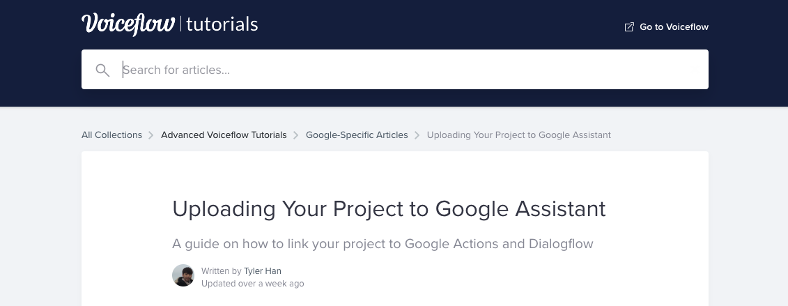

なお2020年1月12日現在では```「Login with the same account,」```の次の部分がガイダンスと違うので、以下のように進めてください。

* https://console.actions.google.com/ で該当のプロジェクトを選び、「Overview」をクリック
* 「Build your Action」→「Add Action（s）」→「Add Action」→「CREATE Action」のポップアップを開く
* （ここから先はVoice公式の説明と同じです。）


Jsonが発行されたら、voiceflowに戻り、「Drop Json File here or Browse」の所にjsonファイルをドラッグ&ドロップして「Upload」をクリックします。


### Googleにアップロード

アップする前に言語設定を確認します。

* VoiceflowのCanvasを開いている状態で、画面左上の「canvas Test Publish」の3つのうち「Publish」をクリック
* 「Google beta」をクリック→Languagesパネルで、「Japanese(ja）」→「Next」
* 「Canvas」に戻り「Upload to Google」のボタンをクリック
* インジケータが回り、10数秒ほどでアップロード完了して、「Action Upload Successfull」と表示される
* 「You may test on the Google Actions Simulator. 」の部分をクリックすると、別窓でシミュレーターが開く。


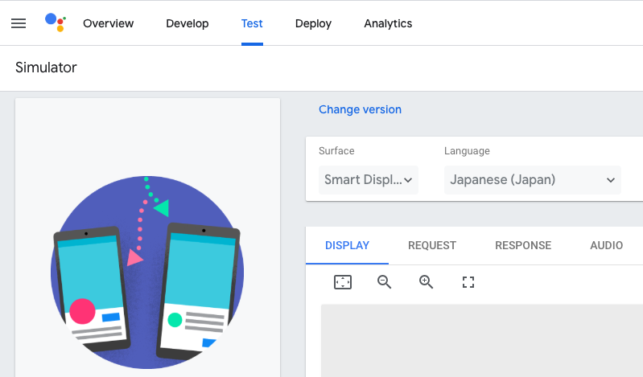

もしアップロードに失敗したら、前の項目「Googleのデベロッパーアカウントとの連携」を見直してください。


さてシミュレーターが開きましたが、いったんスルーしてActionsの呼び名を設定します。一般公開しないのでなんでも良いです。年末のM-1のぺこぱがおもしろかったので、「しょういんじ」にしてみます。

* 「Develop」タブを開き、「Japanese」→「Display name」の設定欄で、Actionsの呼び名を入力

```
Display name：しょういんじ
Google Assistant voice：Male 1
```

* 右上の「Save」をクリック。
* 「Don't forget to update sample invocations in the directory information page」というガイダンスが出るのですがいったんスルー。
* 「Modify Languages」をクリック→「English」のチェックを外して、「Japanese」だけにチェックが入っている状態にする→「Save」をクリック。
* Deleting Languagesの警告がでますが、OKをクリック。
* 「Overview Develop Test Deploy Analytics」のうち「Test」をクリック、
* 画面左下の入力欄に「しょういんじにつないで」と出ているので、カーソルを合わせてエンター押下。
* 「はい。しょういんじのテストバージョンです」と応答があったら、「暖房つけて」と入力してエンター押下。
* 「暖房をつけます。送信しました。」と応答があり、アクションは終了します。

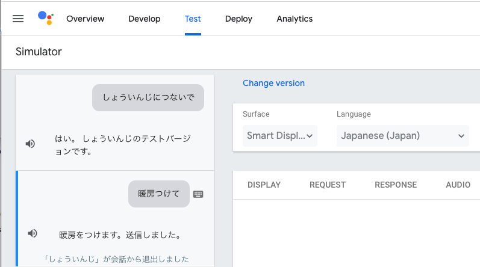


もしエラーが出たら、以下を試してみてください。

* DialogFlowのコンソールを開く https://dialogflow.cloud.google.com/
* 左上の三本線のメニューアイコンをクリックして、先ほど作ったプロジェクトを選び、歯車をクリックします。
* 「General Language MLSettings〜」とタブが並んでいるので「Languages」をクリック
* 「Select Additional Language」をクリックし、「Japanese - ja」を選択
* 「SAVE」をクリック

### 暖房を消すフローの作成

Chromeで開いたvoiceflowの画面に戻り、残りを編集します。

* 一番左の細いペインの一番上のアイコン「Blocks」をクリック
* 「▶︎Logic」→「Set」ブロックをCanvasにドラッグし、Interactionブロックの右側の「2」から線を接続する。
* 上記のsetブロックをクリックし、設定画面を開いたら、以下のように指定。

```
set {device} to: 「aircon」
set {onoff} to: 「off」
```
※2個目を追加するときには「Add Variable Set」をクリックすると入力欄が追加される。

* 「▶︎Basic」→「Speak」ブロックをCanvasにドラッグし、上記のSetの右側から線を接続する。
* Speakブロックをクリックし、設定画面を開いたら、以下のように指定。

```
Speaking as Alexa
暖房を消します
```
* 上記のSpeakブロックの右側からIntegrationsブロックに線を接続する。

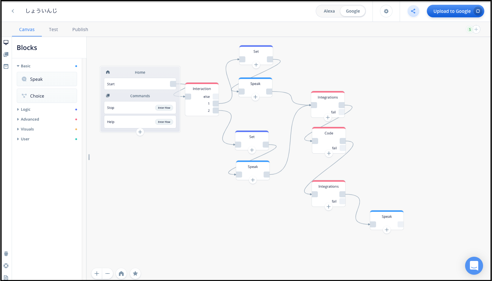

* 全部できたらGoogleにuploadし、先ほどと同じようにシミュレーターで「しょういんじにつないで」→「暖房を消して」と入力し、応答を確認してみましょう。


## M5StickCリモコンをMQTT対応にする

AdafruitのMQTTライブラリを使います。また、Adafruit のMQTT Library をインストールするとついてくるMQTTのサンプルコード「mqtt_2subs_esp8266」をアレンジして使いました。

* Arduino IDEを開き、「スケッチ」→「ライブラリをインクルード」→「ライブラリを管理」→ 検索をフィルタ欄に「Adafruit_mqtt」と検索し、表示されたものをインストール。
* 「ファイル」→「新規ファイル」でスケッチエディタを開きます。下敷き表示されたコードは削除してください。
* Guthubから私の書いたコードをコピーして、スケッチエディタに貼り付けてください。

```
URL：https://GitHub.com/sitopp/vf_techbookfest8_sampleCode
ファイルパス：M5StickC/IRsend_DAIKIN_MQTT_forM5StickC.ino
```

* Wifiのアカウント、Adafruitのユーザー情報、赤外線のパターンは、ご自分の情報で書き換えてください。
10〜11行目、17〜18行目、79〜85行目、91〜97行目の部分です。

```
10 #define WLAN_SSID       ""  //WiFiのSSID
11 #define WLAN_PASS       ""  //WiFiのパスワード
(略)
17 #define AIO_USERNAME    ""  //AdafruitのUsername
18 #define AIO_KEY         ""  //AdafruitのActive Key
(略)
79    uint8_t daikin_code[35] = {
80      0x11, 0xDA, 0x27, 0x00, 0xC5, 0x00, 0x00, 0xD7,
81      0000, 0000, 0000, 0000, 0000, 0000, 0000, 0000,
82      0000, 0000, 0000, 0000, 0000, 0000, 0000, 0000,
83      0000, 0000, 0000, 0000, 0000, 0000, 0000, 0000, 0x00, 0x00, 0x39};  
84      //ダミー。自分のリモコンの信号に書き換えること        
85      irsend.sendDaikin(daikin_code); //メーカー毎にクラスが異なる
(略)
91    uint8_t daikin_code[35] = {
92      0x11, 0xDA, 0x27, 0x00, 0xC5, 0x00, 0x00, 0xD7,
93      0000, 0000, 0000, 0000, 0000, 0000, 0000, 0000,
94      0000, 0000, 0000, 0000, 0000, 0000, 0000, 0000,
95      0000, 0000, 0000, 0000, 0000, 0000, 0000, 0000, 0x00, 0x00, 0x39};  
96      //ダミー。自分のリモコンの信号に書き換えること        
97      irsend.sendDaikin(daikin_code); //メーカー毎にクラスが異なる
``` 

* スケッチエディタの左上にある「→」アイコンをクリックして、M5StickCに書き込みします。
* 保存場所を聞かれるので、適当に指定します。
* 書き込みにかかる時間、数十秒を待ちます。
* 「ツール」→「シリアルモニタ」をクリックして、窓を開きます。

#### IFTTT〜MQTT〜M5StickCの結合テスト

IFTTTのWebhooksに付属のTestツールを使って、結合テストしてみましょう。

* ChromeでIFTTTの「My Services」にアクセス https://ifttt.com/my_services 
* 「Webhooks」 → 「Documentation」
* 「Make a POST or GET Web request to:」の下にあるURLの{event}のところに「M5StickCIRRemoCon」と入力
* 「With an optional JSON body of:」に以下のように入力

```
{ "value1" : "aircon", "value2" : "on", "value3" : "t7d=ClVt" }
```
* 「Test It」をクリック
* シリアルモニタに、以下のメッセージが表示されることを確認。

```
19:26:32.531 -> On-Off button: M5StickCIRRemoCon aircon on t7d=ClVt
19:26:32.568 -> onを通過
```

* OFFの方も確認しましょう。「With an optional JSON body of:」の「"value2" : **"on"**」を「 "value2" : **"off"**」に変更
* 「Test It」をクリック
* シリアルモニタに、以下のメッセージが表示されることを確認。

```
19:26:37.849 -> On-Off button: M5StickCIRRemoCon aircon off t7d=ClVt
19:26:37.886 -> offを通過
```


* M5StickCをUSBケーブルから外し、エアコンの1m以内に置いてきてください。赤外線ユニットはM5StickCにつないだままです。
* といっても、エアコンは天井近くに張り付いているはずですので、M5StickCを床に置くと1mを超えてしまうでしょう。飛距離がつかめるまでは、ガムテープで壁に貼り付けるなどしてください。
* ChromeのIFTTTのWebhook テストツールから、onやoffの信号を送り、エアコンがつく/消えることを確認してください。


## 全部をつなげて動作確認

まず、Actions On Googleのコンソールから実行してみましょう。

* Chromeで https://console.actions.google.com/ にアクセス
* 「Test」→ 左下の入力欄に「しょういんじにつないで」と表示されているので、クリックしてからエンター押下
* 「わかりました。しょういんじのテストバージョンです。」と応答があったら、「暖房つけて」と記入してエンター押下
* 「暖房をつけます。送信しました。」と男性の声で読み上げたあと、1秒後にエアコンがつく。

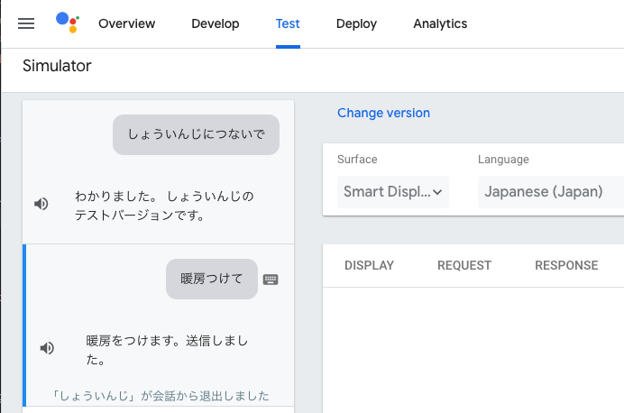


うまくいったら、今度は実機から試してみましょう。

Google homeやGoogle Home Mini、Nest Hubなどをお持ちの人は、開発で使ったのと同じGoogleアカウントでログインしておいてください。


* 「OK Google、しょういんじを呼んで」と呼びかけると、「はい、しょういんじのテストバージョンです」と応答。
* 続けて「暖房をつけて」とお願いすると、「暖房をつけます。送信しました。」と応答し、エアコンがつく。
* 「OK Google、しょういんじを呼んで」と呼びかけると、「はい、しょういんじのテストバージョンです」と応答。
* 続けて「暖房を消して」とお願いすると「暖房を消します。送信しました。」と応答してエアコンが停止。


手元に実機がない場合、スマートフォンのGoogle Assistantでももちろん利用可能です。

* iPhoneかAndroidスマートフォンにGoogle Assistantをインストール
* アプリケーションを起動し、マイクのアイコンをタップして「しょういんじを呼んで」と呼びかける
* Google Homeの実機と同じようにテストができます。


## おまけ：Amazon Alexaへの対応

「interaction」ブロックの「Choices」はAlexa / Googleで作りが違うので、プラットフォーム毎に用意する必要があります。

それ以外の基本ロジックは使い回しでき、プラットフォームへのデプロイも切り替えてボタン一発です。

あらかじめ日本のAlexa デベロッパーアカウント作成をしておく必要がありますので、ネットで調べてみてください。


## まとめ

いかがだったでしょうか。


ハードウェア開発のメイカーさんや組込み系のエンジニアの人に、制御インタフェースの選択肢としてぜひ「音声」をつけていただきたいです。そのためにはVoiceflowはちょうどよくて、Web周りのサーバ構築やらGoogleへのアップロードは全部まとめてVoiceflowが代わりにやってくれます。もちろん製品化する時はもっと正式な手順が必要ですが、ちょっとプロトタイプを作る時にはとても便利です。

たとえば今回のリモコンを例にとると、M5StickCのボタンは3個しかないので、そのままやったら3種類の機能しか持たせられないです。でも音声入力で処理分岐すれば、メモリの許す限りたくさんの種類の家電が制御できますよね。

そしてゆくゆくは、スタートレックのエンタープライズ号のコンピュータやナイトライダーのナイト2000のように音声制御が当たり前の世の中になってほしいです。なるべくはやめに（＾o＾）

VUIを通じて新しいユーザー体験が生み出され、不可逆な進歩が訪れることを願っています。

@mochan-tkさん、@kun432さん、執筆にお誘いくださりありがとうございました。
貴重な場をいただけて感謝の極みです。


@sitopp

https://qiita.com/sitopp


