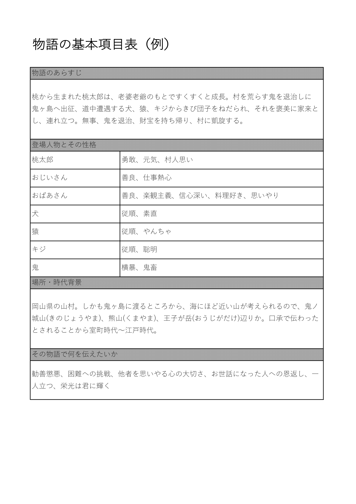
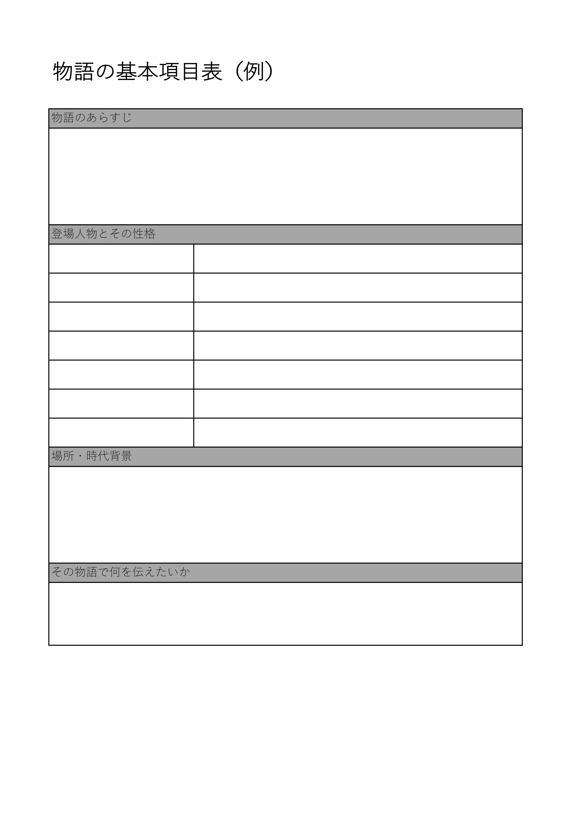
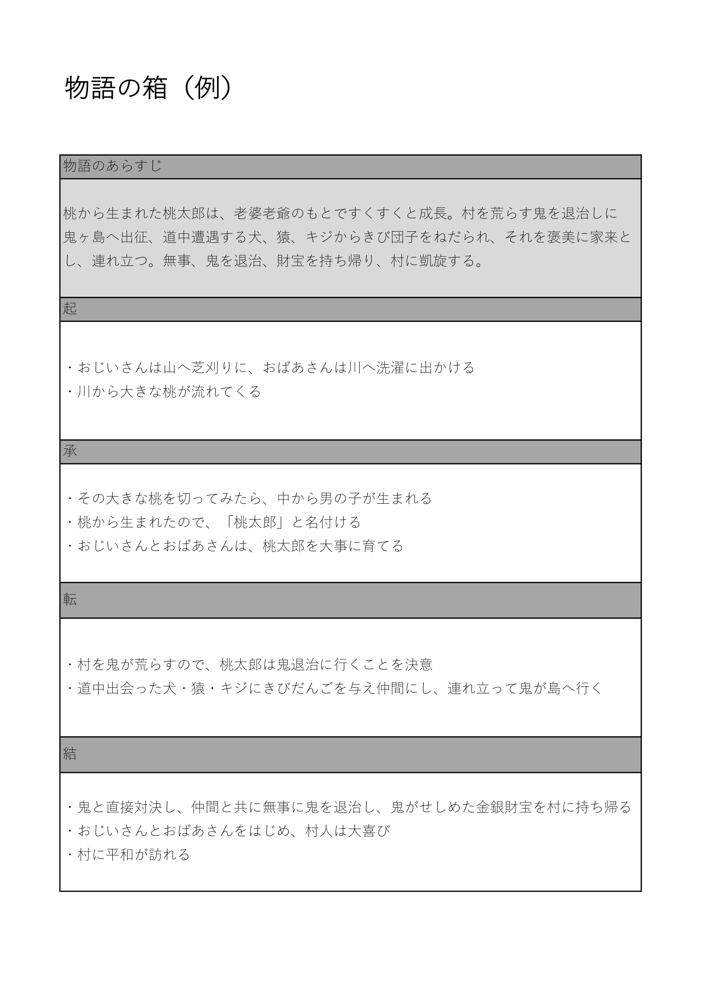
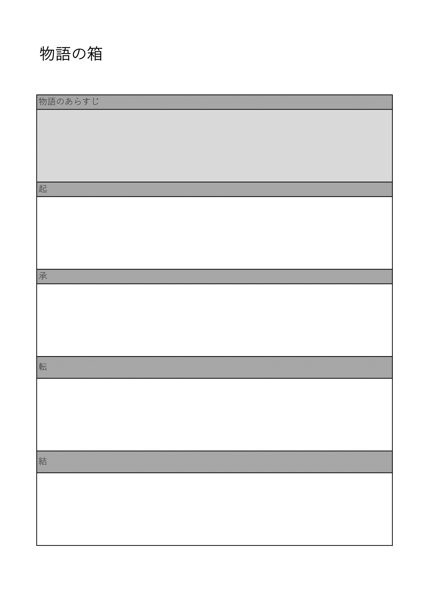

# Voiceflowを使って物語のスキルを作るコツ

## 本章のはじめに

ここまで、さまざまなVoice UI界隈で有名になって来ているVoiceflow使いの猛者たちが、Voiceflowの素晴らしさや使いやすさ、使う時のクセやその克服方法、勘所などをしたためてきていると思うので、本章では、Voice UI/UXデザイナーの私、元木理恵が、今後、個人的に活路を見出している「物語を聞かせる」スキルを作る際のコツのようなものを、僭越ながら皆様に共有させていただきます。

## なぜ「物語を聞かせる」スキルに活路を見出しているか？

### ユーザーの成長期として「聞く」時期に当たる

私は、自社のVoice UI部の立ち上げ時期からの草創メンバーです。
Voice UIは、自社の新規事業として、乗り出すべき領域と社として判断し、2018年4月に部が設立されました。

設立当初は、R&Dという位置づけで、たくさんのスキルを各プラットフォームのローンチ時に提供させていただきました。とにかく、部のメンバーで考え抜いて、またプラットフォーマーの要望も伺いながら、自社の新たなビジネスのため、また、Voice UIの未来のために、様々なスキルを世の中に排出してきました。

そのように実績を地道に作り上げてきた作り手である私には、この執筆を行っている2020年1月の時点では、Voice UIは世の中において、キャズムを超えるにはもう少し時間がかかるという実感があります。

特に、女性向けのゲーム内キャラクターのエンタテインメントを中心に、コンテンツ特化型のスキルを作っているということもあり、「Alexa？何それ、おいしいの？」というリテラシーのユーザーさんが多いことは、想像に難くありません。

しかし、スマートスピーカーに興味を持って買ったという技術書即売会にいらっしゃったエンジニアの方々でも、「スマートスピーカーをニュースと天気くらいにしか使っていない」と言う人が多数なのです。

Voice UIの定義は数多あれど、本章で語るVoice UIは、何もスマートスピーカーに限ったものではありません。

人間が家電や機械など、あらゆるモノやコトを音声で操作する、これを、Voice UIと定義させていただきます。

我々を取り巻く環境のいたるところに、人間が音声で操作することができるモノが、必ず増加します。

それは、そう遠くない未来です。

しかし、2020年1月時点では、まだその未来は訪れていません。日本におけるVoice UIの現状・実態は、まだキャズムを超えていないのです。

Alexaの日本におけるスキル数も2019年10月には3,000を超え、提供されているコンテンツの数としての充実が図られています。

しかし、それに対してユーザーの成長がまだまだ追いついて来ていないのが現状です。

もちろん、それはユーザーのせいだけではありません。
作り手の私たちが、キャズムを超えさせるだけのクオリティのコンテンツ提供が出来ていないことが、その大きな原因なのです。

そんな中、先日、ボイスアップラボさんが「Alexaスキルラーニングデイ」の際の「」というセッションの中でこうおっしゃっていました。

「作り手は色々ユーザーに話しかけてほしいと思ってスキルを作るけれども、ユーザーは聞きたいんだ」

これを聞いて私は、「真髄かもしれない」と感じました。

一旦、これを仮説として置き、「聞く」という行為をいかんなく発揮できるスキルを考えた時に、エンタテインメントに身を置いている私は、真っ先にやはり「物語を聞く」ということを想起しました。

「物語を聞かせる」スキルが、今のユーザー成長期には、ぴったりとはまるのではないかと考える理由は、そこにあります。

### 受動から能動的動作へのスムーズな移行

現時点では、ユーザーが「聞く」という行為以上のことをVoice UIに求めていないと仮定した場合、我々サードパーティーや個人のスキル開発者はどのようにスキルを作っていけばいいのでしょうか？

「物語を聞かせる」スキルは、その一つの解だと思いますが、単純に物語を聞かせるだけでは、ユーザーの成長は見られないでしょう。

より自発的にスマートスピーカーに話しかけて、それに対しての返答で起こる体験を楽しんでいただくことが出来て、初めてVoice UIの魅力に気づいていただけるはずです。

そこで、思いつくのが、「ゲームブック形式の物語スキル」です。

現在、30代後半から40代前半の方々なら、ゲームブックと呼ばれる、文庫本もしくは漫画本サイズで、物語を読み進めて、選択肢から選びながら進めて行くと、その選んだ選択肢によって、結末が異なると言われる本を楽しんだことがあるでしょう。

そのゲームブックの体験をスキルに持ってくるということをしてはどうでしょうか。

聞きながら、自分の意思を声で返答し、それに対して体験が変化する。

「聞く」だけの受動から、能動的動作へのスムーズな移行を生むのです。

ゲームブックの体験をスキルに持ってくるために、もう少しだけ物語について、自論や私が学んだことを語らせてください。

## 物語とは構造である

### ドラマや映画の脚本家を目指して見えたもの

私は、10年ほど前に、自分が今やっている仕事以外で、何がやりたいかを真剣に考えた時期がありました。

考え抜いた挙げ句、たどり着いたのは、映画やドラマの脚本家でした。

なぜ、脚本家になりたかったか？

* 映画やドラマが大好きだったこと。
* 小説を読むことが大好きだったこと。
* 文章を書くことが、苦ではなく、むしろ好きだったこと。

特に、文章を書くことが好きな理由は、サマリー好きな性格である、ということに裏付けられています。

読書感想文は、裏表紙の説明と斜め読みだけでいくらでも書くことができましたし、大学のレポートは、教科書や図書館の文献を引っ張ってきて、それをまとめて、自分がそれに対してどう考えたかを述べるだけで単位をくれるなんて、高校までの勉強よりも数段楽だと思ったほどでした。

そんな私が、自分の「好き」を仕事にするならば、脚本家しかないのではないか。

そう思うようになりました。

シナリオ講座には1年間、仕事の合間を縫って、週2回、通い続けたのですが、残念ながら、脚本家にはなれませんでした。

脚本家は、講座に通ったからと言ってなれる職業ではなく、運と実力、時代を読む力が伴っていないといけません。

そのどれもが、きっと足りなかったのです。

しかし、その1年間で、私は、「物語は構造である」ということを、徹底的に教え込まれました。

それまで、脚本家は文系の仕事だとばかり思っていました。

心に残るセリフを書くことが出来るのは、小説やドラマ、映画に触れてきた文系の人間だと信じていました。

しかし、それよりも先に物語としての組み立てがうまく行っていないと、観る人を惹き付ける作品を書き上げる事は出来ないのです。

映画やドラマの脚本だけではありません。

世の中にある全ての物語は構造にのっとったものだと、言い切ることができます。

それは、Voice UIにおける物語スキルについても同じことだと断言します。

---

### Voice UIにあった物語の構造とは何か？

「構造、構造って言うけれども、どうやって物語を作っていけばいいんだ・・・」

そんな声が聞こえてきそうです。

それでは、いよいよVoice UIにあった物語の構造を紐解いて行きたいと思います。

1.物語の基本項目を埋めよう

物語を作るための基本項目表を作りました。物語の最も骨子となる基礎的な情報を入れ込むシートです。

これは、既存の物語を分岐させて行く時にも使えますし、新規の物語を作っていく時にも使えます。

例として、わかりやすく既存の物語に「桃太郎」（版権フリー）を選択しました。

* 物語のあらすじ

物語のあらすじは、人間の身体で言う背骨にあたるものです。
どんな物語なのかを、短い文章で簡潔に記入してください。

* 登場人物とその性格

その物語の登場人物とそれぞれの性格を、これも短い文章で簡潔に記入してください。

* 場所・時代背景

その物語が展開される場所や、時代背景を記入してください。

今回、例として「桃太郎」を挙げていますが、既存の物語（版権フリー）の場合は、文献やインターネットから情報を調べて見てください。
オリジナルの物語の場合は、自分が決めた場所や時代背景を記入してください。

* その物語で何を伝えたいか

その物語で何を伝えたいかを、10個以内で記入してください。
10個以内に収める理由は、あまり多くなると、伝えたいことがブレてしまうためです。

2.物語のあらすじから箱を作っていこう

基本項目を埋めた後は、物語のあらすじを、細かく箱に分けて行きます。

箱というのは、物語のある程度の塊を入れるブロックのことです。

今回は、わかりやすく「起承転結」の４部構成にしていますが、物語によっては「起承転結」に当てはまらないものもあります。その場合は、この箱の表の項目を自由に書き換えてください。

その箱には、物語の重要なポイントを箇条書きにして、記入して行きます。

どのタイミングで、誰に、何が起こるか？というポイントになる出来事を、簡潔に記入してしていきましょう。

今回の例「桃太郎」のような、誰もが知っている物語では、逆引きをする形になりますが、これはこれで、なかなか難しいかもしれません。

しかし、いくつかやってみると、だんだんと慣れて来るので、数をこなしてみてください。

3.プロットにしていこう

箱に分けた物語の箇条書きから、次はプロットにしていきます。

だんだんと物語の形に近づけていきますので、最終形を意識しながら、箇条書きを元に、もう少し文章になるように肉付けを行なっていきます。

今回の例の「桃太郎」もこのままだと、普通の「桃太郎」になってしまうので、このタイミングで分岐をつけてみました。
鬼ヶ島に行くことを決意するも、作戦を立てて、仲間のうち、犬だけが先に乗り込んでいった場合、どうなるか・・・
これだけでも、十分に既存の物語とは異なる物語になりますね。

4.スキルの履歴書を書こう

ここで、スキルとしての履歴書を作っておきましょう。

物語を作ることとは別に、スキルを作る時にも履歴書が必要です。

これについては、「スマートスピーカーアプリのお品書き」に詳細を記載したのですが、昨今は画面付きのデバイスも登場しましたので、項目として改めたものもありますので、こちらでも紹介しておきます。

5.効果音を考えてみよう

効果音は、物語スキルにおいて非常に重要です。

効果音を入れることで、臨場感やシズル感を出すことができ、ユーザーを物語に没入させることができます。

アメリカのAlexaスキルマーケットで、非常に注目を集めている、「St.Noire」というボードゲームxAlexaで遊ぶミステリーゲームがあります。

大変売れ行きがよく、Amazonのアメリカのストアでは、売り切れ状態が続いているそうです。

この冒頭のシーンで使われている効果音は以下の通りです。

BGM

ドアが開く音

ドアが閉まる音

少しガヤガヤした騒音

足音

ライターで火をつける音

煙を吐き出す息の音

溜息

です。

この冒頭のシーンは、たった●分●秒しかありません。

その短い時間の中に多数の効果音が出てくるということは、以下に物語のスキルにおいて、効果音が重要かということがわかるかと思います。

効果音が大事なことはわかったけれども、一体効果音をどこから拝借してくるか？という問題があります。

いくつか効果音が見つかる（そして利用してもいい）サイトを紹介します。

・Amazon Alexaの開発者サイトから

・
利用規約

・
利用規約

・
利用規約

自分で録音する方法もありますが、ノイズが入ってしまうので、録音機材など、環境が整っていない場合は、上記のようなサイトを利用することをオススメします。

6.文章をブラッシュアップしよう

ここで、ユーザーに聞かせるための文章として整えます。

Alexaスキルを開発して行く時に、プロジェクトのメンバー同士でAlexa役とユーザー役に別れて、読み合いをするというのはよく使う方法です。

自然な会話になっているかどうか？

足りないユーザーのサンプル発話はないか？

抜け落ちている工程はないか？

などを確認するために必要な作業です。

ぜひ、協力者を見つけて、実践することをオススメします。

そうして、会話実践をしながら、文章を書き進めます。
文章を書き進めると、いくつか気づくことがあると思います。

Alexaの日本語がたどたどしい

これはSSMLを使って解決していきましょう。

登場人物の声を変えたい

男性の声はTakumi、女性の声はMizukiをベースに利用して、ここからさらにSSMLを使って、声の高い・低いや、スピードなどである程度は解決していくことができます。

しかし、やはりちゃんと感情をこめたセリフにしたいと言う場合は、声優さんを当てるのが良いかと思います。

たまたま、自社のサービスでは、社内に声優の学校に通っているメンバーがいたので、その人に協力してもらって、作ったキャラクターのスキルがあります。
そのメンバーは、真面目に声優の勉強をしていたので、「こんな機会が自社の仕事で訪れるなんて」とビックリしながらも、快く協力してくれました。

そのような駆け出しの声優さんや声優の卵の人などに、お声がけして、交渉ができるインターネットのサービスもありますので、そういったところで探してみるのもいいかもしれません。

もし、実際に声優さんに依頼する場合は、全ての物語を書き終えたら、セリフに当たる箇所だけを抜き出して、台本の形にします。

そして、どんな感情で声優さんに読んで欲しいかと言う指示を記入します。

声優さんにどのような物語かというあらすじを頭に入れてもらうことと、その登場人物の性格や癖などは、別途お伝えする必要があります。

台本の例も掲載しておきますね。

7.Voiceflowを使って、動かしてみよう

Voiceflowの使い方については、この本でも、たくさん語られていると思いますので、それを見て、実戦してみてください。

また、2020年以降も何度か、清水さんやもっちゃんさんが中心となって、Voiceflowのイベントを、全国各地で行いますので、参加してみてください。

おそらく、物語スキルが最もVoiceflowの習作には向いているのではないかと考えています。

2019年

もちろん、これだけが正解ではありません。

色々とお話を作ってみて、あなただけの「ゲームブック的物語スキル」の構造はこれだ！というものを編み出して行ってください！

